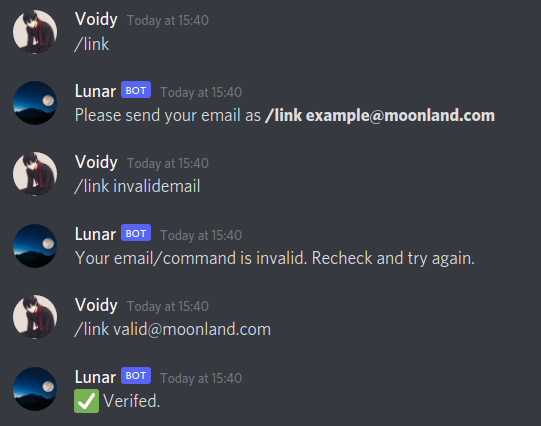
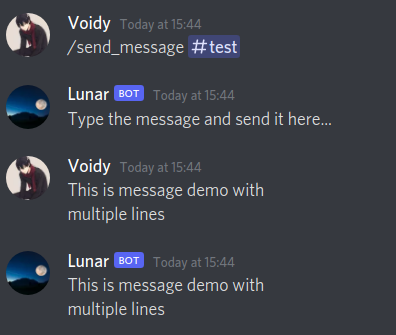
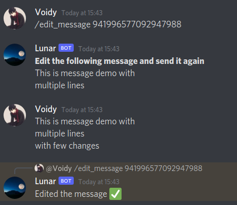

# Lunar Discord Bot
A discord bot for the Moonland server.

## Getting Started

1. Create a virtual environment and activate it. 
    ```
    >>> "python3 -m pip install virtualenv
    >>> virtualenv venv
    >>> source ./venv/bin/activate"
    ```
2. Install pip packages
    ```
    pip install -r requirements.txt
    ```
3. Create a file named `.env` and save the token in the file as
    ```
    TOKEN=BOT_TOKEN_ID
    ```
4. Set up google services
    1. Create a new project named anything (Eg: Moonland Lunar Bot) https://console.developers.google.com/apis/

    2. Search and enable google drive api service and google sheets api service

    3. Create a new service account and share me your service email https://console.developers.google.com/apis/credentials

    4. Add a new key for your service account and download the services.json file and move it to the bot's directory or `.configs/gspread/` directory.

    5. Create a google sheets, and the service email as an editor.
5. Run the `bot.py` file
    ```
    python bot.py
    ```

## Bot Commands / Working
1. **On new member join** : When a new member joins, a row with its username, userid, coins, cash and email is added in `./csv/users.csv` file.

2. **/wallet** : If the user has joined the server, when the user direct messages the bot with `/wallet`. The bot replies with the following message.


3. **/link** : If the user direct messages the command `/link`, following messages are replied.



4. **/send_message** : Use this command to send message as a bot, on one of your servers text channels. (not DM). Create a private #bot-commands, and use it specifically for this command.

    ```
    /send_message #text-channel
    <Your message>
    ```


5. **/edit_message**: Use this command to edit the message of bot, on one of your servers text channels. (not DM). Create a private #bot-commands, and use it specifically for this command.

Right click on any of bot's message and copy its message id. If copy id is not available, enable develop mode from settings.

    ```
    /edit_message messageid
    <Your message>
    ```



## Author
@IsharMhzn
